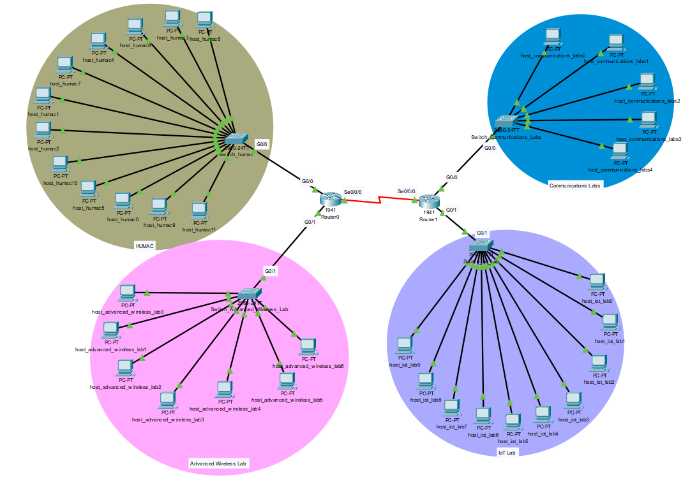

# Networking Cisco Packet Tracer Project

This repository contains the group assignment for NET1014 (February 2025), focusing on networking concepts and practical implementation using Cisco Packet Tracer. The project aims to provide hands-on experience in designing, configuring, and troubleshooting computer networks in a simulated environment.

## Contents

- **NET1014 - Group Assignment - Feb2025.pdf**  
  The main assignment brief detailing project requirements, objectives, and grading criteria.

## Project Overview

The project covers the following key areas:

- Network topology design
- Device configuration (routers, switches, PCs, etc.)
- Implementation of security measures (ACLs, VLANs, etc.)
- IP addressing, subnetting, and routing protocols
- Troubleshooting and testing network connectivity

## Getting Started

1. **Read the Assignment Brief:**  
   Download and read [[NET1014 - Group Assignment - Feb2025.pdf](https://github.com/Qiyou0103/networking-cisco-packet-tracer-project/blob/29018ff70abd8dea91372488c0d4c1a6414df57b/NET1014%20-%20Group%20Assignment%20-%20Feb2025.pdf)] for full instructions and requirements.
   [[Networking Report.pdf](https://github.com/Qiyou0103/networking-cisco-packet-tracer-project/blob/0d48b00e44066a9bba57750e654a9ec3e29a5ad1/Networking%20Report.pdf]

3. **Tools Required:**  
   - [Cisco Packet Tracer](https://www.netacad.com/courses/packet-tracer)
   - PDF reader (for the assignment brief)

4. **How to Use This Repo:**  
   - Clone the repository to your local machine:
     ```bash
     git clone https://github.com/Qiyou0103/networking-cisco-packet-tracer-project.git
     ```
   - Open the assignment PDF and follow the provided instructions to complete your network design and implementation in Cisco Packet Tracer.

## License

This project is intended for educational purposes only.

## Output of Cisco Packet Tracer



---
